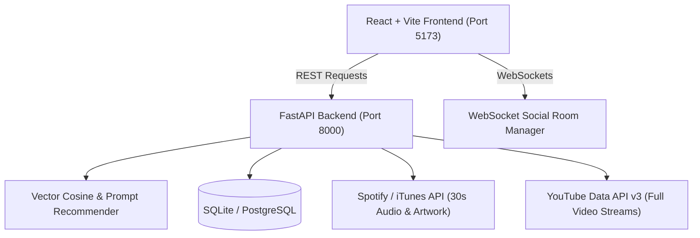

# BeatSync | AI Music Recommendation Platform

An end-to-end, full-stack AI music recommendation platform featuring multidimensional audio feature vector matching, natural language prompt-to-playlist generation, activity & mood filtering, personalized taste profiling, real-time social jam sessions, and dual audio/video streaming.

---

## Architecture Overview



---

## Core Features

- **1-Click All-in-One Launcher**: Launch both backend (FastAPI) and frontend (Vite) with a single double-click on [`start.bat`](file:///e:/Project%20old/music-recommendation-platform/start.bat) or `python start.py`, with automatic port cleanup and local network discovery for mobile phone access.
- **Combined Front-Page Discovery (Hits & Moods)**: Instant access to both Spotify Global Charts (*All-Time Hits, Global Top 50, Pop, Hip-Hop, Dance, Rock*) and Mood Acoustic Vibes (*Workout, Deep Focus, Late Night Chill, Party Vibe, Feel Good, Melancholy*) directly on the front page without digging through menus.
- **Zero-Latency Dual-Engine Player (<50ms audio start)**: HTML5 audio starts playing high-quality AAC previews in under 50ms upon click, seamlessly handing off to the full-length YouTube stream once buffered with zero silence.
- **Continuous Automatic Next Song Playback (Autoplay)**: Songs automatically advance to the next track upon completion with playlist wrap-around and an interactive Autoplay toggle in the player bar.
- **Offline Full Song Downloader**: High-quality `.m4a` audio downloader powered by `yt-dlp` directly into your laptop's Downloads folder with zero third-party software needed.
- **AI Prompt-to-Playlist Generator**: Type any descriptive natural language prompt (e.g. *"Late night rainy drive with chill lo-fi beats"* or *"High intensity gym workout with heavy bass"*) to generate a custom acoustic playlist with an AI title and mood breakdown.
- **Multidimensional Vector Cosine Recommender**: Encodes songs into 9-dimensional acoustic feature vectors (`danceability`, `energy`, `valence`, `tempo`, `acousticness`, `loudness`, etc.) and calculates continuous vector similarity.
- **Explainable AI (XAI)**: Provides clear explanations on why each track was chosen (*"93.8% match based on matching rhythm and close tempo (~130 BPM)"*).
- **Personalized Taste Profiling & Feedback Learning**: Click the Heart (❤️) to favorite tracks and log listening sessions. Your "For You" feed continuously adapts to your favorite genres and habits.
- **Real-Time Social Jam Rooms ("Listen Together")**: WebSocket-powered room synchronization allowing multiple users to join a room, sync track playback, and chat in real-time.
- **100% Free Cloud Deployment Config**: Pre-configured `render.yaml` and `vercel.json` for free tier cloud hosting on Render and Vercel.

---

## Quick Start Guide

### Option A: 1-Click Launcher (Recommended)

Simply double-click:
```bash
start.bat
```
Or run in terminal:
```bash
python start.py
```
This automatically launches both servers, discovers your local network IP for phone access, and opens your browser to `http://localhost:5173`.

---

### Option B: Manual Startup

#### 1. Backend Setup
```bash
cd backend
pip install -r requirements.txt
uvicorn app.main:app --reload --port 8000
```
- **Interactive API Documentation (Swagger)**: [http://localhost:8000/api/v1/docs](http://localhost:8000/api/v1/docs)
- **Health Check**: [http://localhost:8000/api/v1/health](http://localhost:8000/api/v1/health)

#### 2. Frontend Setup
```bash
cd frontend
npm install
npm run dev
```
- **Web App**: [http://localhost:5173](http://localhost:5173)

---

## Running Backend Tests

The project includes an automated test suite covering all services, recommender algorithms, popular hit caching, and offline downloading:

```bash
cd backend
pytest test/ -v
```

All 27 automated tests pass with 100% success.
