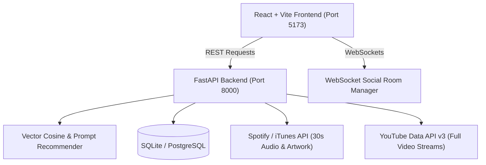

# BeatSync | AI Music Recommendation Platform

An end-to-end, full-stack AI music recommendation platform featuring multidimensional audio feature vector matching, natural language prompt-to-playlist generation, activity & mood filtering, personalized taste profiling, real-time social jam sessions, and dual audio/video streaming.

---

## Architecture Overview



---

## Core Features

- **AI Prompt-to-Playlist Generator**: Type any descriptive natural language prompt (e.g. *"Late night rainy drive with chill lo-fi beats"* or *"High intensity gym workout with heavy bass"*) to generate a custom acoustic playlist with an AI title and mood breakdown.
- **Multidimensional Vector Cosine Recommender**: Encodes songs into 9-dimensional acoustic feature vectors (`danceability`, `energy`, `valence`, `tempo`, `acousticness`, `loudness`, etc.) and calculates continuous vector similarity.
- **Explainable AI (XAI)**: Provides clear explanations on why each track was chosen (*"93.8% match based on matching rhythm and close tempo (~130 BPM)"*).
- **Personalized Taste Profiling & Feedback Learning**: Click the Heart (❤️) to favorite tracks and log listening sessions. Your "For You" feed continuously adapts to your favorite genres and habits.
- **Activity & Mood Presets**: Instant filtering for **Workout**, **Deep Focus / Study**, **Late Night Chill**, **Party Vibe**, **Feel Good / Happy**, and **Melancholy**.
- **Real-Time Social Jam Rooms ("Listen Together")**: WebSocket-powered room synchronization allowing multiple users to join a room, sync track playback, and chat in real-time.
- **Dual Streaming Engine**:
  - Instant 30-second AAC audio preview clips via HTML5 Web Audio.
  - Full-length YouTube video streams embedded in an expandable floating mini-player.
- **Quota-Preserving In-Memory Cache**: Preserves external API quotas for YouTube Data API v3.
- **Multi-Provider Fallback**: Seamless fallback to open music catalog search when Spotify developer credentials encounter restrictions.

---

## Quick Start Guide

### 1. Backend Setup

Ensure you have Python 3.10+ installed.

```bash
cd backend

# Install dependencies
pip install -r requirements.txt

# (Optional) Seed the database with diverse tracks across genres
python -m app.utils.seed

# Start the FastAPI server
uvicorn app.main:app --reload --port 8000
```

- **Interactive API Documentation (Swagger)**: [http://localhost:8000/api/v1/docs](http://localhost:8000/api/v1/docs)
- **Health Check**: [http://localhost:8000/api/v1/health](http://localhost:8000/api/v1/health)

### 2. Frontend Setup

Ensure you have Node.js 18+ installed.

```bash
cd frontend

# Install dependencies (already completed)
npm install

# Start the development server
npm run dev
```

- **Web App**: [http://localhost:5173](http://localhost:5173)

---

## Running Backend Tests

The project includes an automated test suite covering all 5 phases:

```bash
cd backend
pytest test/ -v
```

All 20 automated tests will pass.
